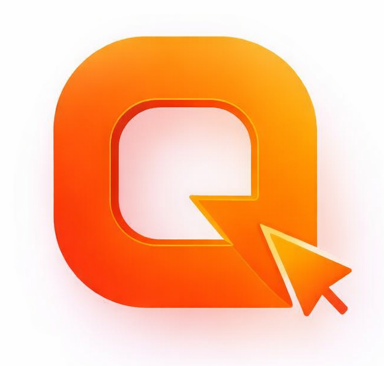
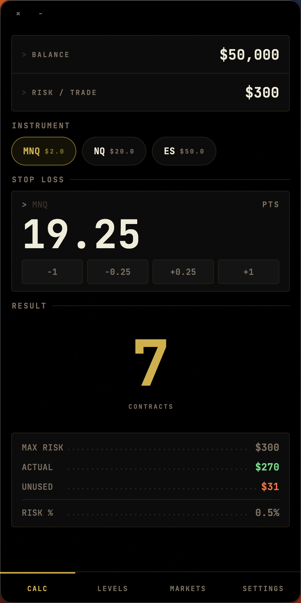
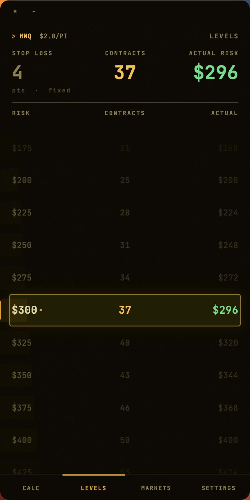
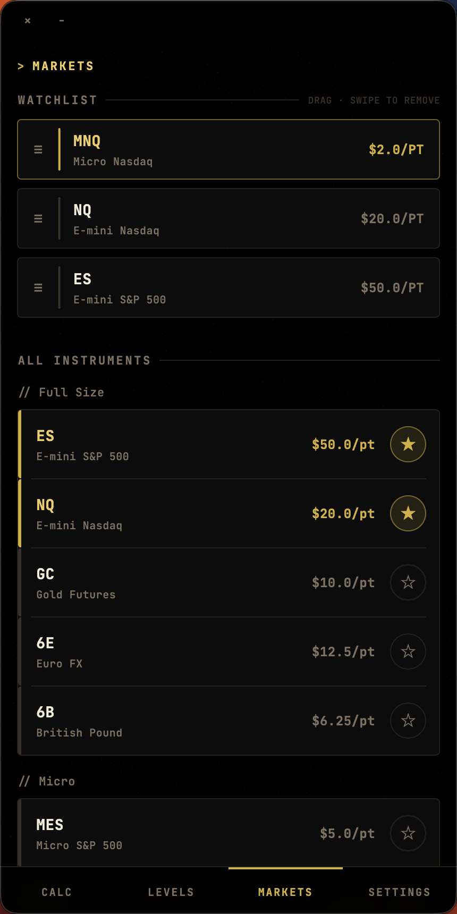
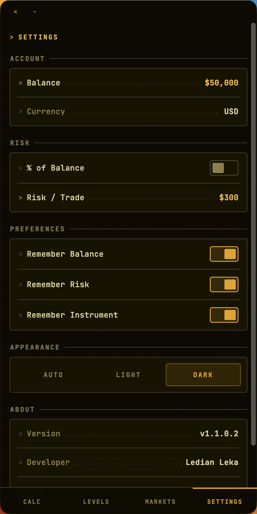

<p align="center">
  
  <h1 align="center">Quanta — Position Size Calculator</h1>
  <p align="center">A terminal-styled futures position size calculator built for <strong>Quantower</strong> traders. Enter your account balance, risk per trade, and stop loss — get the exact number of contracts instantly. Always whole numbers, never fractional.</p>
  <p align="center">
    <a href="https://github.com/Ledian63S/quanta/releases"></a>
    <a href="https://github.com/Ledian63S/quanta/releases"></a>
  </p>
</p>

---

## Screenshots

<p align="center">
  
  
  
  
</p>

---

## Download

Get the latest release for your platform from the [Releases page](https://github.com/Ledian63S/quanta/releases).

| Platform | Download |
|----------|----------|
| macOS | `Quanta-macOS-vX.X.X.X.zip` |
| Android | `Quanta-Android-vX.X.X.X.apk` |
| Windows | `Quanta-Windows-vX.X.X.X.zip` |
| iOS | `Quanta-iOS-vX.X.X.X.zip` — sideload via AltStore |

---

## Features

- **Instant calculation** — contracts update live as you type
- **Always floors** — no rounding up, no fractional contracts
- **Levels table** — see contracts and actual risk for stop levels ±3 points from your entry
- **Instrument management** — star favorites, only they appear in the calculator
- **Risk modes** — set risk as a fixed dollar amount or % of balance
- **Persistent settings** — balance, risk, and instrument remembered across sessions
- **Dark / Light / Auto theme** — follows system or manually set
- **Terminal aesthetic** — amber-on-dark UI with scanline overlay

---

## Supported Instruments

| Ticker | Name | Point Value |
|--------|------|-------------|
| ES | E-mini S&P 500 | $50 |
| NQ | E-mini Nasdaq-100 | $20 |
| GC | Gold Futures | $10 |
| CL | Crude Oil | $10 |
| 6E | Euro FX | $12.50 |
| 6B | British Pound | $6.25 |
| MES | Micro E-mini S&P 500 | $5 |
| MNQ | Micro E-mini Nasdaq-100 | $2 |
| MGC | Micro Gold | $1 |

---

## Calculation

```
contracts  = floor(riskAmount / (stopLossPoints × pointValue))
actualRisk = contracts × stopLossPoints × pointValue
unused     = riskAmount − actualRisk
```

---

## Build from Source

**Prerequisites:** Flutter SDK ≥ 3.0.0

```bash
git clone https://github.com/Ledian63S/quanta.git
cd quanta
flutter pub get
flutter run
```

Platform-specific:
```bash
flutter build macos --release
flutter build apk --release
flutter build windows --release   # Windows only
flutter build ipa --release       # iOS, requires Apple Developer account
```

---

## Tech Stack

- **Flutter** — cross-platform UI
- **Provider** — state management
- **Google Fonts** — Manrope (UI) + JetBrains Mono (numbers)
- **window_manager** — custom desktop title bar
- **url_launcher** — external links
- **package_info_plus** — dynamic version display

---

## License

MIT — see [LICENSE](LICENSE)

---

Made with ♥ for traders
